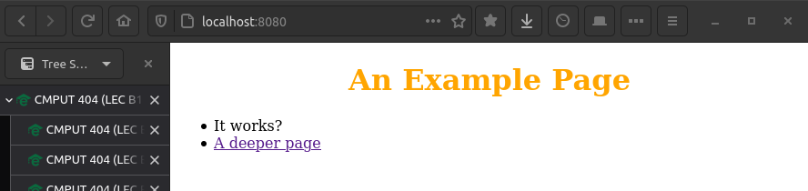
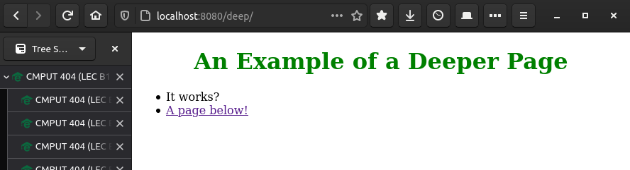

CMPUT404-assignment-webserver
=============================

CMPUT404-assignment-webserver

See requirements.org (plain-text) for a description of the project.

Make a simple webserver.

Contributors / Licensing
========================

Generally everything is LICENSE'D under the Apache 2 license by Abram Hindle.

server.py contains contributions from:

* Abram Hindle
* Eddie Antonio Santos
* Jackson Z Chang
* Mandy Meindersma 
* Hugh Bagan

But the server.py example is derived from the python documentation
examples thus some of the code is Copyright © 2001-2013 Python
Software Foundation; All Rights Reserved under the PSF license (GPL
compatible) http://docs.python.org/2/library/socketserver.html

---

## Screenshots

root.png

deep.png

## Sources

* Luky. "How to properly send HTTP response with Python using socket library only?" https://stackoverflow.com/a/28056437
* Python docs. "socketserver" https://docs.python.org/3.6/library/socketserver.html
* Python docs. "socket" https://docs.python.org/3.6/library/socket.html
* Python docs. "os.path.isfile" https://docs.python.org/3.6/library/os.path.html#os.path.isfile

